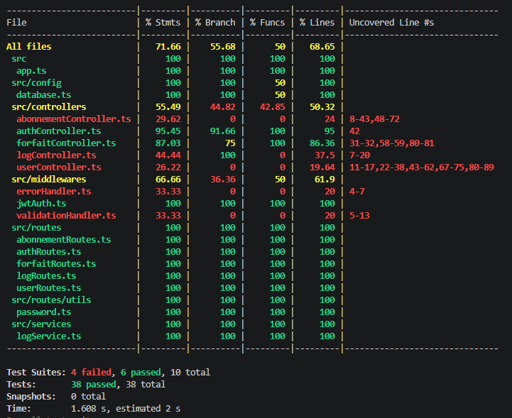

# Rapport de projet — Les Arcs 1800


## 1. Pitch de l'application

**Les Arcs 1800** est une application web fullstack de gestion et de vente de forfaits de ski pour la station Les Arcs 1800, dans les Alpes françaises.

### Ce qu'elle fait

L'application se découpe en deux espaces distincts :

**Espace public (visiteurs)**
- Consultation des forfaits disponibles (Pass 1 jour, Pass 6 jours, Pass Saison)
- Achat d'un forfait via un tunnel de paiement avec création de compte ou connexion
- Affichage des conditions météo en temps réel via l'API Open-Meteo

**Espace pro (utilisateurs connectés)**
- Consultation de ses propres abonnements actifs
- Pour les **administrateurs** : gestion complète des utilisateurs (consultation, modification de rôle, suppression)

### Problème résolu

Permet à une station de ski de gérer sa clientèle et ses abonnements numériquement, avec une distinction claire entre les rôles visiteur, utilisateur et administrateur, le tout sécurisé par JWT.

---

## 2. Refactoring initial

### Ce qui a été refactorisé

Le refactoring principal a consisté à migrer vers une architecture **MVC stricte** :

| Avant | Après |
|-------|-------|
| Tout dans `server.ts` | `server.ts` → uniquement démarrage |
| Logique métier inline | `controllers/` → authController, userController, forfaitController, logController |
| Pas de middleware dédié | `middlewares/` → jwtAuth, errorHandler, validationHandler |
| Connexion DB inline | `config/database.ts` → Singleton Sequelize |

### Difficultés d'adaptation pour les membres du groupe

**Les variables d'environnement Docker** : le fichier `.env` chargé par `dotenv` en local ne se comporte pas de la même façon dans Docker avec `--env-file`. Les valeurs entourées de guillemets (`DATABASE_URL="..."`) sont interprétées littéralement par Docker, ce qui cassait la connexion Sequelize en production.

**Sinon pas plus de difficulté** : Le projet a été initialement développé par Timoté. La base de code était plus ou moins claire, ce qui a facilité la prise en main par les autres membres du groupe. La séparation en couches MVC étant déjà en place, chacun a pu rapidement identifier où intervenir sans avoir à comprendre l'intégralité du projet. Le fontend était par contre un peu compliqué à prendre en main.

---

## 3. Infrastructure de déploiement




### Flux d'une requête en production

1. L'utilisateur accède à `http://91.134.138.162:82` → **Nginx** sert le build React statique
2. Le navigateur exécute le JS React, qui fait des appels vers `http://91.134.138.162:3000/api`
3. **Express** (container server) reçoit la requête, passe par les middlewares JWT/validation
4. Le controller interroge **Supabase** (PostgreSQL cloud) via Sequelize
5. La réponse JSON remonte jusqu'au navigateur

---

## 4. Design Patterns utilisés

### Singleton — `src/config/database.ts`

**Où :** La classe `Database` maintient une instance privée statique de Sequelize.

**Pourquoi :** Une connexion à la base de données est une ressource coûteuse. Sans Singleton, chaque module qui importe la connexion pourrait créer sa propre instance, multipliant les connexions ouvertes vers Supabase et épuisant le pool. Le Singleton garantit qu'une seule connexion est créée et partagée dans toute l'application.

```typescript
// config/database.ts
export class Database {
  private static instance: Sequelize; // instance unique

  public static getInstance(): Sequelize {
    if (!Database.instance) {
      Database.instance = new Sequelize(process.env.DATABASE_URL, ...);
    }
    return Database.instance; // toujours la même
  }
}
```


---

### MVC (Model-View-Controller) — Architecture globale

**Où :** Séparation en `models/` (Sequelize), `controllers/` (logique métier), `routes/` (entrées HTTP).

**Pourquoi :** Permet à plusieurs développeurs de travailler en parallèle sans conflits. Un développeur peut modifier la logique d'un controller sans toucher aux routes ni aux modèles. La testabilité est améliorée car les controllers peuvent être testés indépendamment de la couche HTTP (Supertest) ou de la base de données (mocks Jest).

---

### Middleware Chain — `src/middlewares/`

**Où :** `jwtAuth.ts`, `errorHandler.ts` branchés dans `app.ts`.

**Pourquoi :** Les préoccupations transversales (authentification, validation, gestion d'erreurs) sont isolées de la logique métier. Une route protégée s'écrit simplement `router.get('/', authenticateToken, getAllUsers)` sans répéter la vérification JWT dans chaque controller.

---

## 5. Rapport de couverture de tests

Commande : 

`cd server `

` npm run test:coverage`




